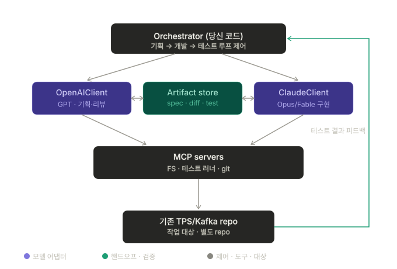

# Multi-Model Orchestration Harness

> GPT(기획·리뷰)와 Claude(구현)가 SDLC 단계를 나눠 맡아 **구조화된 산출물**(spec / diff / test report)로
> 협업하는 멀티모델 오케스트레이션 하네스. 학습 목적 — 기성 프레임워크(LangGraph/CrewAI) 없이
> 오케스트레이터·어댑터·MCP 배선·검증 루프를 from scratch로 구현한다.
>
> 설계 문서: [docs/multi-model-harness-design.md](docs/multi-model-harness-design.md)



## 핵심 원칙

1. **오케스트레이터(내 코드)가 루프를 소유한다.** 모델은 어댑터 뒤의 stateless 함수처럼 호출된다.
2. **핸드오프는 항상 구조화된 산출물로.** 모델끼리 raw 채팅을 주고받게 두면 드리프트·상호 동의·무한 루프에 빠진다.
3. **결정론적 테스트가 수다를 닫는다.** 통과/실패가 ground truth, 실패 로그가 다음 입력.
4. **턴 상한.** 수렴하지 못하면 강제 종료한다.

## 구조

```
orchestrator/          # 단계 상태머신·제어 흐름·tool loop — 루프 소유자
│   ├── runner.py      # 진입점: 기획 → 개발 → 테스트 (실패 시 개발로 루프백)
│   ├── tool_loop.py   # 모델 tool_use ↔ 도구 실행 루프 (직접 구현)
│   └── phases/        # planning(GPT 생성↔Claude 비평) / development(Claude 구현→GPT 리뷰)
├── adapters/          # LLMClient 추상화 — GPT·Claude를 동일 인터페이스로
│   ├── base.py        # 공통 인터페이스 + 정규화 타입 (ModelResponse/ToolCall)
│   ├── openai_client.py
│   ├── claude_client.py
│   └── fake.py        # 스크립트된 fake — API 키 없이 하네스 루프 검증
├── mcp_servers/       # MCP 서버 (직접 작성) — 설계 문서의 mcp/ (공식 mcp SDK와 임포트 충돌로 개명)
│   └── filesystem.py  # 파일시스템 stdio 서버 (root 밖 경로 차단)
├── artifacts/         # 산출물 스키마 + run 단위 저장 — 설계 문서의 artifacts/
│   └── schema.py
├── evals/             # 검증 게이트 — 설계 문서의 eval/ (내장 함수명 회피로 개명)
│   └── gate.py
├── tests/             # 하네스 자체의 결정론적 테스트 (fake 어댑터로 전체 루프 검증)
└── config.py          # 모델·턴 상한·target repo·테스트 명령
```

## 실행

```bash
py -3.13 -m venv .venv
.venv\Scripts\activate
pip install -r requirements.txt

# 하네스 자체 검증 (API 키 불필요 — fake 어댑터)
pytest

# 실제 실행 (키 필요) — .env에 API 키 기재 (config.py가 임포트 시점에 로드)
copy .env.example .env
python -m orchestrator.runner "주문 조회 API에 페이징을 추가하라"
```

대상 레포(testbed)는 `config.py`의 `target_repo` — 기본값은 형제 디렉터리의
[event-driven-commerce](https://github.com/JYPark-Code/event-driven-commerce) (1000 TPS 실증 프로젝트).
결정론적 테스트(통합 테스트 25개)와 부하 테스트가 이미 있어 검증 게이트의 ground truth로 쓴다.

## 비목표

Managed Agents · LangGraph/CrewAI · 제품 출시 — 설계 문서 10절 참고.
