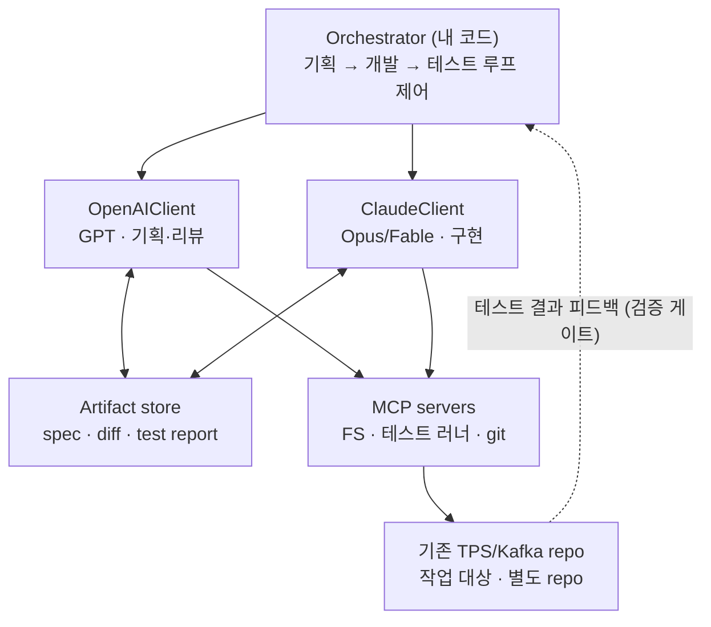

# Multi-Model Orchestration Harness — 설계 문서

> GPT와 Claude가 SDLC 단계(기획 → 개발 → 테스트)를 나눠 맡아
> 산출물 기반으로 협업하는 멀티모델 오케스트레이션 하네스.
> 기존 TPS/Kafka e-commerce 프로젝트를 **작업 대상(target)** 으로 삼는다.

---

## 1. 목적 (Why)

- **MCP 구성 경험**: 단일 벤더 도구(예: oh-my-claude)가 아니라, MCP 서버를 직접 배선해 보면서 그 레이어를 이해한다.
- **하네스를 직접 만들어 배우기**: 기성 프레임워크(LangGraph/CrewAI)를 쓰지 않고 오케스트레이션·어댑터·평가 루프를 from scratch로 구현한다.
- **크로스 벤더 오케스트레이션**: GPT ↔ Claude 협업은 단일 벤더 도구로는 안 되는 영역이다. 이 프로젝트의 비대체적 가치.
- **Harness Engineering의 첫 실증**: 기존에 정리해 온 프레임워크(Input/Constraint/Verification/Decomposition/Interface/Iteration)를 실제 코드로 검증한다.

이 프로젝트는 **제품으로 출시하려는 것이 아니라 학습용**이다. 그 전제가 모든 설계 결정의 기준이 된다.

---

## 2. 저장소 전략 (New repo vs. 기존 확장)

**결정: 새 repo로 만들고, 기존 TPS 프로젝트를 작업 대상으로 둔다.**

이유는 관심사 분리:

- 하네스는 본질적으로 **프로젝트 무관(generic)** 도구다. TPS repo 안에 박으면 (1) 재사용 불가능해지고 (2) 포트폴리오 서사가 흐려진다.
- TPS repo의 서사는 "시스템을 만들어 1,000 TPS를 측정했다."
- 하네스 repo의 서사는 "멀티모델 개발 하네스를 만들었다."
- 깔끔한 서사 둘 > 흐린 서사 하나.

기존 TPS 프로젝트는 하네스의 **첫 번째 testbed**로 붙인다. (이미 결정론적 테스트와 부하 테스트가 있어 검증 게이트의 ground truth로 쓰기 좋다.)

---

## 3. 아키텍처 (Architecture)

핵심 원칙: **오케스트레이터(내 코드)가 제어를 쥐고, 모델은 어댑터 뒤의 stateless 함수처럼 호출된다.** 모델끼리 자유 채팅으로 흐름을 끌게 두지 않는다.



### 레이어 설명

| 레이어 | 역할 | 핵심 포인트 |
|---|---|---|
| Orchestrator | 단계 상태머신, 제어 흐름, 루프백 | 내 코드가 루프를 소유한다 |
| Model adapters (`LLMClient`) | GPT·Claude를 동일 인터페이스로 추상화 | 모델명은 설정값일 뿐, 교체해도 오케스트레이터 불변 |
| Artifact store | 모델 간 **핸드오프 인터페이스** | raw 대화가 아니라 구조화된 산출물로 주고받는다 |
| MCP servers | 모델이 세상을 만지는 도구 레이어 | 파일시스템·테스트 러너·git |
| Target project | 하네스가 작업하는 대상 | 별도 repo, 첫 testbed |

---

## 4. 단계 모델 (Phase model)

| 단계 | 담당 | 산출물 | 종료 조건 |
|---|---|---|---|
| 기획 | GPT 생성 → Claude 비평 (generator ↔ critic) | `spec.md` | 합의 또는 턴 상한 |
| 개발 | Claude(Opus/Fable) 구현 → GPT diff 리뷰 | `diff`, 코드 | 리뷰 통과 또는 턴 상한 |
| 테스트 | **결정론적 구간** — 기존 테스트 + 부하 테스트 실행 | `test report` | 통과 시 종료 / 실패 시 개발로 루프백 |

### "티키타카"의 실속 있는 버전

모델 둘이 raw 대화 로그를 주고받게 만들면 드리프트·상호 동의(sycophancy)·무한 루프에 빠진다. 그래서:

1. **핸드오프는 항상 구조화된 산출물을 통해서** 한다. 모델은 채팅하는 게 아니라 `spec.md` / `diff` / `test report`를 읽고 쓴다.
2. **턴 수에 상한(max turns)** 을 걸어 수렴 못 하면 강제 종료한다.
3. **결정론적 테스트가 수다를 닫는다.** 통과/실패가 ground truth이고, 실패 로그가 다음 입력이 된다.

---

## 5. 모델 호출 (Model invocation)

두 모델 모두 HTTP API로 부른다. Anthropic Messages API(`client.messages.create`)는 OpenAI API(`chat.completions.create`)와 모양이 거의 같아 어댑터가 대칭으로 떨어진다.

### Claude 쪽 선택지

- **코어 API 클라이언트** (`anthropic` / `@anthropic-ai/sdk`): Messages API·스트리밍·tool use·프롬프트 캐싱. GPT의 OpenAI SDK와 같은 레이어.
- **Agent SDK** (`claude-agent-sdk`): Claude Code에서 추출한 상위 하네스. 에이전트 루프·내장 툴·MCP 연동 내장.

**결정: 학습 목적이므로 코어 API + 직접 짠 tool loop를 쓴다.**
Agent SDK를 쓰면 편하지만 그건 Anthropic의 하네스를 쓰는 것이지 내가 하네스를 만드는 게 아니다. 또한 Claude만 내장 루프를 갖고 GPT는 안 그래서 어댑터가 비대칭이 된다. → 두 어댑터 모두 코어 API 레벨로 통일, 루프는 오케스트레이터가 소유.

### tool loop 패턴

```python
# 공통 인터페이스 — GPT/Claude 둘 다 이 모양
class ClaudeClient(LLMClient):
    def __init__(self):
        self.c = Anthropic()
    def run(self, messages, tools=None):
        return self.c.messages.create(
            model="claude-fable-5",        # 구현=Fable, 리뷰=opus 식 분리
            max_tokens=4096, messages=messages, tools=tools or [])

# 오케스트레이터가 소유하는 tool loop (직접 구현)
resp = claude.run(messages, tools)
while resp.stop_reason == "tool_use":
    results = [exec_via_mcp(b) for b in resp.content if b.type == "tool_use"]
    messages += [{"role": "assistant", "content": resp.content},
                 {"role": "user", "content": results}]
    resp = claude.run(messages, tools)
```

### 모델 역할 분리 (초기 가정)

| 모델 문자열 | 용도 |
|---|---|
| `claude-fable-5` | 무거운 구현 (장시간 자율 작업) |
| `claude-opus-4-8` | 빠른 동기 작업 (리뷰·문서 정리) |
| GPT (최신 플래그십) | 기획·diff 리뷰 — 정확한 버전은 `OpenAIClient` 설정값 |

> 진짜 에이전트형 Claude가 필요해지면 기본 어댑터에 섞지 말고 **별도 노드로** Agent SDK를 붙인다.

---

## 6. MCP 레이어

- 모델이 작업 대상 repo를 만지는 통로. 초기엔 **파일시스템 서버 1개**로 시작.
- 이후 테스트 러너, git 서버 추가.
- 코어 Messages API도 MCP 서버를 직접 물릴 수 있고 Agent SDK는 MCP가 기본 내장 — "MCP 써보기" 목표는 어느 경로든 충족.

---

## 7. MVP 슬라이스 (얇은 수직 슬라이스부터)

풀세트로 가지 말고, 척추 한 줄부터 돌린다.

- 모델 **2개** (GPT, Claude)
- 단계 **2개** (기획 → 개발)
- MCP 서버 **1개** (파일시스템)
- 게이트 **1개** (기존 테스트 스위트)

> 목표: "GPT가 짠 spec을 Claude가 구현하고 테스트가 통과하면 멈춘다"가 한 번 끝까지 돈다.

이후 붙일 것: 테스트 자동 루프백, git MCP, 부하 테스트 연동, 서브에이전트.

---

## 8. Harness Engineering 매핑

| 프레임워크 요소 | 이 프로젝트에서 |
|---|---|
| Input design | 각 모델에게 태스크를 어떻게 프레이밍하나 |
| Constraint design | 턴 상한 + 산출물 스키마 (티키타카가 안 새게 막는 방파제) |
| Verification loop | 결정론적 테스트 게이트 |
| Decomposition | 단계 분할 (기획/개발/테스트) |
| Interface design | Artifact store 스키마 |
| Iteration model | 테스트 실패 시 개발 단계로 루프백 |

---

## 9. 저장소 구조 (제안)

```
multi-model-harness/
├── orchestrator/        # 단계 상태머신, 제어 흐름, 루프 소유
│   ├── runner.py
│   └── phases/          # planning / development / test
├── adapters/            # LLMClient 추상화
│   ├── base.py          # 공통 인터페이스
│   ├── openai_client.py
│   └── claude_client.py
├── mcp/                 # MCP 서버 정의·배선
│   └── filesystem.py
├── artifacts/           # 산출물 스키마 + 저장 (spec/diff/report)
│   └── schema.py
├── eval/                # 검증 게이트, 결정론적 평가
└── README.md
```

---

## 10. 비목표 (Out of scope)

- **Managed Agents**: 런타임·호스팅까지 Anthropic이 처리하는 프로덕션용(`/v1/agents` 등). 학습 프로젝트엔 오버킬.
- **LangGraph / CrewAI**: from scratch 구현이 목적이므로 의존하지 않음.
- **제품 출시**: 학습·포트폴리오가 목적. 운영 안정성·인증·과금 제어 등은 범위 밖.
